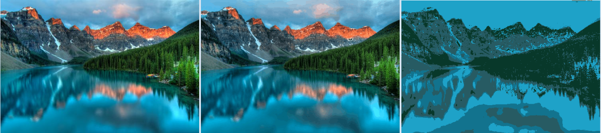

# K Means Image Clustering Sample

The repository contains a small java application demonstrate how we can use k-means algorithm to compress raw images.

[Download jar File](target/kmeans-image-sample-1.0-SNAPSHOT-jar-with-dependencies.jar)

## Usage

You can run download the jar-with-dependencies file in the target folder then run the following command :

`java -jar target\kmeans-image-sample-1.0-SNAPSHOT-jar-with-dependencies.jar <bmp-image-file> <k-means-parameter>`

For windows you can just edit the `run.bat` file in the repository.

## Demonstration

#### Nature : Original, 256 and 4 colors

#### Face : Original, 4 and 2 colors

## Used libraries 

- [ELKI Project](https://elki-project.github.io/)
- [Apache Commons IO](https://commons.apache.org/proper/commons-io/)
- [Apache Commons Lang](https://commons.apache.org/proper/commons-lang/)
